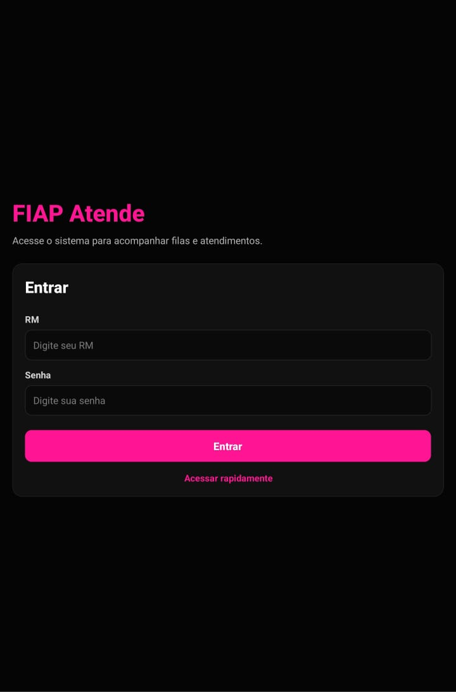
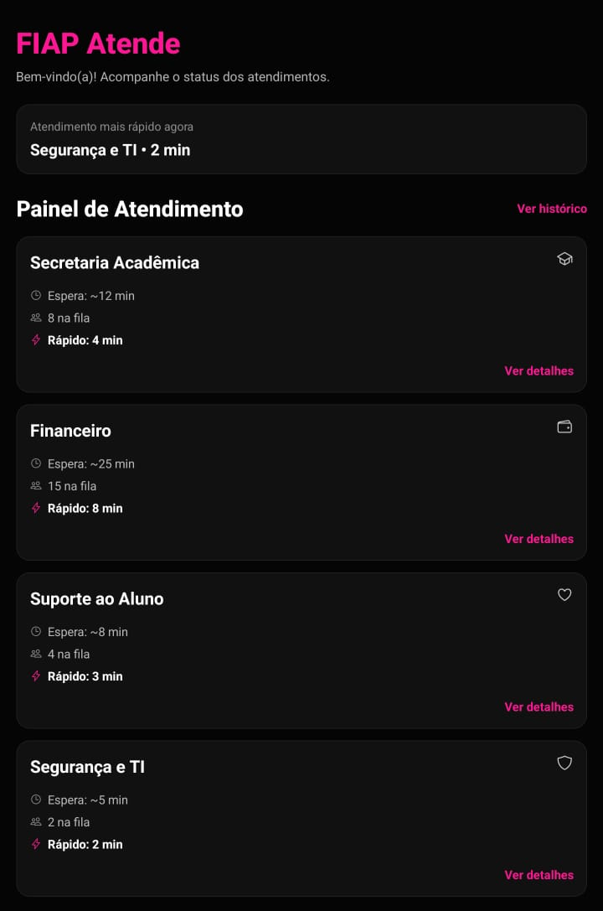
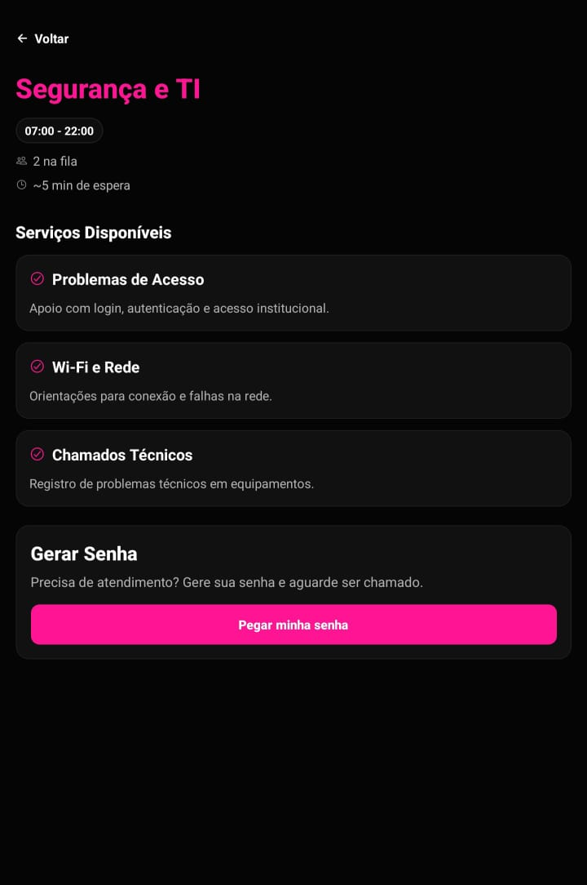

# FIAP Atende

Aplicativo mobile desenvolvido em **React Native com Expo** que simula um sistema de gerenciamento de filas e atendimento para alunos da FIAP.

O objetivo do aplicativo é permitir que estudantes acompanhem o tempo de espera, visualizem os setores disponíveis e gerem uma senha de atendimento diretamente pelo celular, evitando filas físicas e melhorando a experiência de atendimento dentro da instituição.

---

# Sobre o Projeto

O **FIAP Atende** foi criado para resolver um problema comum em ambientes acadêmicos: a dificuldade de organização e acompanhamento das filas de atendimento em setores administrativos.

O projeto foi inspirado em situações reais que ocorrem no **Help Center da FIAP**, onde muitos alunos precisam buscar atendimento para resolver questões acadêmicas, financeiras ou técnicas.

Com o aplicativo, os alunos podem:

- acompanhar o tempo médio de espera  
- verificar quantas pessoas estão na fila  
- visualizar os serviços disponíveis em cada setor  
- gerar uma senha digital de atendimento  

Assim, o estudante pode **acompanhar o atendimento diretamente pelo celular**, reduzindo a necessidade de filas físicas.

---

# Repositório do Projeto

https://github.com/jalbino0/fiap-cpad-cp1-FIAP-Atende

---

# Operação da FIAP escolhida

A operação escolhida foi **Atendimento ao Aluno**.

Esse setor foi selecionado porque concentra grande parte das interações entre alunos e a instituição, como:

- matrícula e rematrícula  
- emissão de documentos  
- suporte financeiro  
- suporte acadêmico  
- suporte técnico  

A proposta do aplicativo é **otimizar o fluxo de atendimento**, oferecendo maior transparência e organização para os estudantes.

---

# Funcionalidades Implementadas

## Login
- Tela inicial de acesso ao sistema
- Simulação de login com RM e senha

## Dashboard
- Exibe setores disponíveis
- Mostra tempo médio de espera
- Mostra quantidade de pessoas na fila

## Detalhes do Setor
- Horário de funcionamento
- Serviços disponíveis
- Pessoas na fila
- Tempo médio de espera

## Geração de Senha
- Geração automática de senha
- Código único de atendimento
- Posição na fila
- Tempo estimado de espera

## Acompanhamento
- Visualização da posição na fila
- Status do atendimento

## Histórico
- Lista de atendimentos anteriores
- Status do atendimento
- Data e setor

---

# Telas do Aplicativo

| Tela de Login | Painel de Atendimento | Detalhes do Setor |
|---------------|----------------------|------------------|
|  |  |  |

| Geração de Senha | Senha Gerada | Histórico de Atendimento |
|------------------|--------------|--------------------------|
|  |  |  |

---

# Demonstração do Aplicativo

Vídeo demonstrando o funcionamento do aplicativo.

- login no sistema  
- visualização dos setores  
- geração de senha  
- acompanhamento da fila  
- histórico de atendimentos  

Link do vídeo:  
https://youtube.com/shorts/ewc0EdE4wvI?feature=share

---

# Integrantes do Grupo

- Giovanna Fernandes Pereira — RM: 565434  
- João Pedro de Moura Albino — RM: 565323  
- Kauê Silva Matheus — RM: 561675  

---

# Como Rodar o Projeto

## Pré-requisitos

- Node.js  
- npm ou yarn  
- Expo CLI  
- Aplicativo **Expo Go**

---

## Clonar o repositório

```bash
git clone https://github.com/jalbino0/fiap-cpad-cp1-FIAP-Atende.git
```

Entrar na pasta do projeto:

```bash
cd fiap-cpad-cp1-FIAP-Atende
```

Instalar dependências:

```bash
npm install
```

ou

```bash
yarn install
```

Executar o projeto:

```bash
npx expo start
```

Após iniciar:

- escaneie o **QR Code com Expo Go**
- ou rode em **emulador Android/iOS**

---

# Estrutura do Projeto

```
app/
   _layout.js
   index.js
   home.js
   detalhes.js
   senha.js
   historico.js

components/
   SectorCard.js

context/
   AtendimentoContext.js

data/
   setores.js

assets/
   screenshots/
      login.png
      home.png
      detalhes.png
      senha.png
      historico.png
```

Descrição da estrutura:

- `_layout.js` → configuração global de navegação
- `index.js` → tela de login
- `home.js` → painel principal de atendimento
- `detalhes.js` → informações detalhadas do setor
- `senha.js` → geração e acompanhamento da senha
- `historico.js` → histórico de atendimentos
- `SectorCard.js` → componente reutilizável para exibição dos setores
- `AtendimentoContext.js` → gerenciamento global de estado
- `setores.js` → dados simulados dos setores

---

# Navegação

A navegação do aplicativo foi implementada utilizando **Expo Router**, que cria rotas automaticamente com base na estrutura de arquivos dentro da pasta `app`.

O arquivo **`_layout.js`** define a estrutura global de navegação do aplicativo e configura o **Stack Navigator** responsável por gerenciar a navegação entre as telas.

Exemplo simplificado:

```javascript
import { Stack } from "expo-router";

export default function Layout() {
  return <Stack />;
}
```

As rotas são definidas automaticamente pelos arquivos presentes na pasta `app`.

Estrutura de rotas:

```
/index → Tela de Login
/home → Dashboard
/detalhes → Informações do setor
/senha → Geração de senha
/historico → Histórico de atendimentos
```

A navegação entre telas é realizada utilizando o hook:

```javascript
useRouter()
```

---

# Gerenciamento de Estado

O projeto utiliza **React Context API** através do arquivo:

```
AtendimentoContext.js
```

Esse contexto é responsável por:

- armazenar a senha atual  
- armazenar o histórico de atendimentos  
- gerar novas senhas  
- cancelar atendimentos  

Isso permite compartilhar dados entre diferentes telas do aplicativo.

---

# Hooks Utilizados

**useState**

Utilizado para controle de estados locais, como campos de login, senha atual e histórico.

**useContext**

Permite acessar os dados compartilhados pelo `AtendimentoContext`.

**useRouter**

Responsável pela navegação entre telas utilizando Expo Router.

---

# Interface do Aplicativo

O aplicativo utiliza **dark mode**, inspirado no estilo visual da FIAP.

Principais características:

- layout mobile-first  
- navegação simples  
- componentes reutilizáveis  
- ícones com **Ionicons**

---

# Melhorias Futuras

- integração com API real de atendimento  
- atualização da fila em tempo real  
- notificações quando a senha estiver próxima  
- autenticação institucional  
- integração com banco de dados  
- painel administrativo para gerenciamento das filas  

---

# Tecnologias Utilizadas

- React Native  
- Expo  
- Expo Router  
- React Context API  
- JavaScript  
- Ionicons  

---

# Licença

Projeto desenvolvido para fins acadêmicos na **FIAP**.
